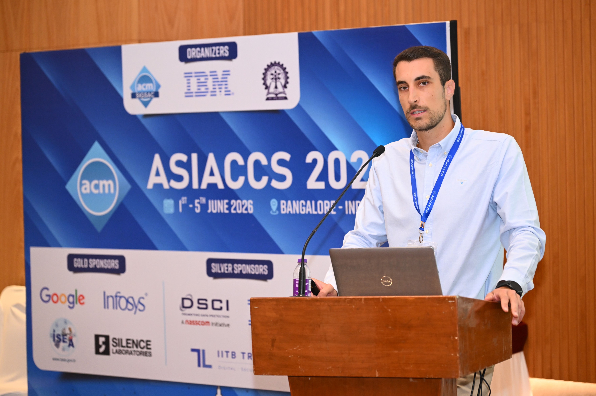

+++
author = "Carlo Ramponi"
title = "Presenting TAGSHIELD at AsiaCCS 2026"
date = "2026-06-24"
tags = [
    "publication",
    "conference",
]
+++

Presenting TAGSHIELD at AsiaCCS 2026 was a particularly meaningful experience for me, as it was my first academic conference as a speaker.

TAGSHIELD addresses stack memory corruption in memory-unsafe C and C++ software by building on Arm Memory Tagging Extension (MTE). The main contribution of the paper is TAGShield, a runtime mitigation mechanism that enforces persistent and deterministic protection for stack spatial memory errors while preserving pointer tag integrity. It combines compile-time tagging with lightweight instrumentation to keep tags correct and to reduce the risk that pointer arithmetic or adversarial manipulation weakens the defense.

The results are encouraging: the evaluation shows that TAGShield can substantially improve protection with modest overhead, while remaining effective on representative workloads such as SPEC CPU2006 and nginx.

I would like to thank all the co-authors for their collaboration, and in particular Michele Grisafi, whose contribution was central to this work.

It was also a pleasure to attend the conference in India. And yes, the mango there is awesome.
